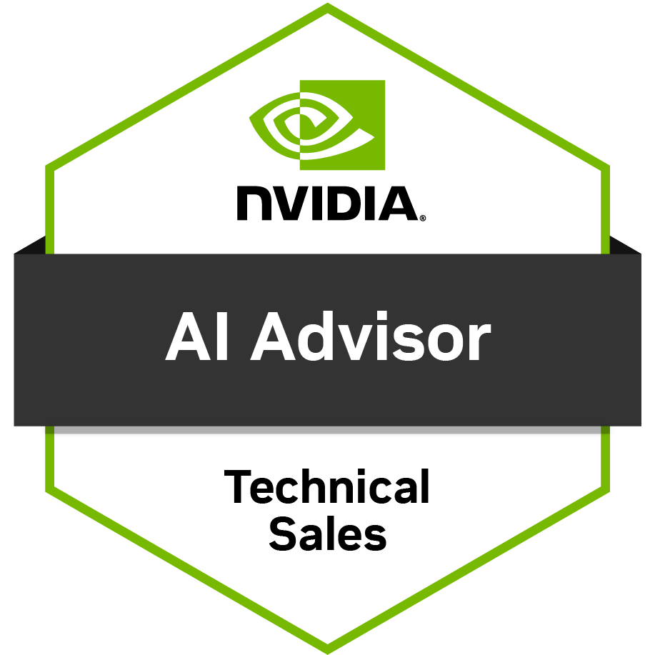
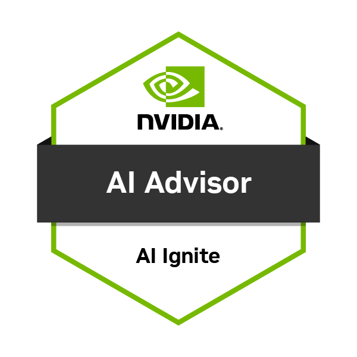

<h1 align="center">Hi, I'm Mark Lynd</h1>

  <strong>Executive-Level Forward-Deployed Engineer for AI and Cybersecurity</strong> 
  5x CEO/CIO/CISO - Head of Executive Advisory and Strategy at <a href="https://netsync.com">Netsync</a> 
  <a href="https://marklynd.com">marklynd.com</a> - <a href="https://thehypeindex.com">The Hype Index</a>

---

## What I Do

I work forward-deployed, effectively an Executive Forward Deployed Engineer (FDE) for AI and cybersecurity. I was doing this job, embedded with the C-suite and boards, long before anyone called it FDE or Applied AI Architect or Cyber Engineer. On the frontline of a customer's hardest AI and cybersecurity decisions, I turn each into a call they can act on this week. Not a research summary. Not a vendor pitch. Whether the job is shipping AI into production safely or getting ahead of the next attack, I bring the one decision that moves risk, cost, or advantage. I work closely with a customer's C-suite, Leadership, Management, and/or board, learn the real problem where it lives, assess where they actually stand, and stay until the decision ships.

And I build. I design and run production AI systems myself, using agent loops, tool use, guardrails, evaluations, and retrieval, wired to live payment and data infrastructure. 

Builder enough to ship. Senior enough to sit with a board and say what is true, including when the answer is to wait.

Credentials: [NVIDIA AI Advisor - Technical Sales](https://www.credly.com/badges/0997c3ed-359b-492b-bdeb-d221b607c237) and [NVIDIA AI Ignite](https://www.linkedin.com/in/marklynd/details/certifications/) (both issued September 2026); ISC2 CISSP, ISSAP, and ISSMP.

  
  

Also, I work on cybersecurity problems and postures for our commercial, enterprise and public sectors clients. More often than not now it involves AI as well. I do this in many ways and forms including advising, speaking, workshops and tabeltops. 

As a 5-time CEO/CIO/CISO I understand how the customer thinks and operates giving me an advantage in being able to help them.

---

## What I Have Shipped Here

| Project | What it is |
|---|---|
| [**mcp-ai-governance**](https://github.com/marklynd/mcp-ai-governance) | MCP server exposing AI governance as callable tools. Maps 180 controls across NIST AI RMF, ISO/IEC 42001, and the EU AI Act; scores organizational readiness; classifies EU AI Act risk tiers; generates remediation roadmaps. Ships with an eval harness (hit@1 0.82, MRR 0.89) and 215 tests. |
| [**mcp-approvals**](https://github.com/marklynd/mcp-approvals) | MCP server implementing a human-in-the-loop approval gate for agents. An agent cannot take a consequential action without a human decision, and every decision lands in a tamper-evident, hash-chained audit log. 153 tests. |
| [**ai-security-reading-list**](https://github.com/marklynd/ai-security-reading-list) | Curated AI security reading list for CISOs and boards. |

Both MCP servers are Python, typed, tested, and MIT licensed.

**Resume:** [Mark-Lynd-Resume.pdf](https://github.com/marklynd/marklynd/raw/main/Mark-Lynd-Resume.pdf)

---

## Background

- **5x CEO / CIO / CISO** across global organizations
- **Executive advisory** to CIOs, CISOs, Chief AI Officers, boards, and leadership teams across public sector, commercial, and enterprise organizations
- **600+ projects, keynotes, panels and workshops** facilitated
- **150+ executive incident response tabletop exercises** facilitated
- **CISSP, ISSAP, ISSMP** held continuously for 20+ years
- **NVIDIA AI Advisor - Technical Sales** issued September 2026 ([verify credential](https://www.credly.com/badges/0997c3ed-359b-492b-bdeb-d221b607c237))
- **NVIDIA AI Ignite** issued September 2026 ([see LinkedIn credentials](https://www.linkedin.com/in/marklynd/details/certifications/))
- **Assessments and Audits** I run hands-on AI and cybersecurity assessments and audits, then turn the findings into a plan leaders can act on.
- **Applied AI** I built and sold to an IBM Partner an AI expert system in Prolog and LISP while in college. As Chief Product Officer, my team and I shipped multiple commercial versions of software with and using neural networks, machine learning and genetic algorithms in production at FireScope from 2006 - 2014. I served on the IBM Watson Thought Leadership Council and did deep learning engagements using Watson Studio. I coded and made the architecture calls, and cleaned and loaded the data.
- **Books:** Three published titles on cybersecurity, cyber insurance, and digital safety for teens; *Think Bigger. Spend Once.*, on AI strategy and governance, is in pre-release
- **US Army veteran** - 3rd Ranger Battalion, 75th Ranger Regiment, and 2nd Battalion 325th Airborne Infantry Regiment (82nd Airborne Division)

---

## Current Rankings (Thinkers360, 2026)

| Discipline | Global Rank |
|------------|:-----------:|
| Data Center | **#3** |
| Cloud | **#4** |
| Security | **#4** |
| Cybersecurity | **#5** (#1 in 2023) |
| Artificial Intelligence | **#7** |

[See full Thinkers360 profile](https://www.thinkers360.com/tl/mark-lynd/)

---

## What I Work On

**Artificial Intelligence**
- Agentic AI in production, with guardrails, evaluations, and human-in-the-loop control
- AI governance and accountability (NIST AI RMF, ISO/IEC 42001, EU AI Act)
- Moving AI out of pilots and into governed production
- AI readiness assessments and audits

**Cybersecurity**
- Executive incident response and crisis decision-making
- Security assessments and audits (NIST CSF, ISO 27001, SOC 2, MITRE ATT&CK)
- Board-level cyber risk and disclosure readiness
- Cyber resilience for critical infrastructure

---

## Writing

**Books**

- **[Think Bigger. Spend Once.](https://marklynd.com/books/)** - Pre-release. An executive guide to AI investment decisions, human authority, responsible AI, and governance that survives a change of model.
- **[Cyber War: One Scenario](https://www.amazon.com/Cyber-War-Scenario-Mark-Lynd-ebook/dp/B0FB1C2LMQ)** - Amazon bestseller. A scenario-based account of a coordinated cyberattack on American infrastructure, written to make the consequences tangible for business leaders and policy makers.
- **[A Leader's Playbook for Cyber Insurance, Second Edition](https://www.amazon.com/Leaders-Playbook-Cyber-Insurance-Second-ebook/dp/B0G2HTX729/)** - The executive field manual for cyber insurance, written from the policyholder side. Coverage mechanics, exclusions that deny claims, renewal negotiation, and claim preparation.
- **[Cybersecurity Life Skills for Teens](https://www.amazon.com/Cybersecurity-Life-Skills-Teens-cybersecurity-ebook/dp/B0C36LJJF7/)** - The cybersecurity skills that matter most in daily life, written for teens and adopted by educators and CTE programs nationwide.

**Newsletter**

- **[The Hype Index](https://thehypeindex.com)** - the consolidation of Hype Check Now and Hype Check Live. One public AI or cybersecurity claim per edition, scored 0 to 100 against the evidence, with a dated call graded in public. Tuesdays and Thursdays, free. The full 226-edition archive is at [thehypeindex.com/archive](https://thehypeindex.com/archive).

---

  <a href="https://marklynd.com">marklynd.com</a> -
  <a href="https://www.linkedin.com/in/marklynd/">LinkedIn</a> -
  <a href="https://x.com/mclynd">X</a>

